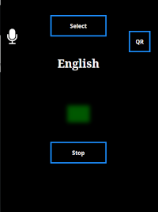
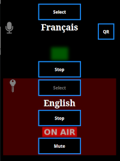
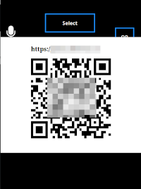

# WiFi-xlation
## Venue WiFi Audio Translation for mobile devices
A simultaneous audio translation system for venues using local WiFi and the web browser of mobile devices based on Web RTC. The server is packaged in a [Docker](https://www.docker.com/) utilising the the [Janus WebRTC Server](https://github.com/meetecho/janus-gateway), [Nginx web server](https://www.nginx.com/) and the [Ubuntu Lunar](https://hub.docker.com/_/ubuntu) image.

Any web browser can be used to send or receive the translation. The UI currently targets mobile devices to provide a simple, clear interface for language selection and reception.

A QR code can be popped up to share the translation URL around the venue.

A simple configuration file, languages.conf, contains the names of the language channels and corresponding passwords for the translators.

It is also possible to send audio to a channel using [Opus](https://opus-codec.org/) over RTP, for example, from [ffmpeg](https://ffmpeg.org/). This way, one channel can then be used to relay the on-stage sound to translators in different rooms of the venue.

Multiple translators can use the same channel simultaneously. This is so that they can hand over to each other without breaking the transmission. The translators on the same channel will be able to hear each other.

  

# Building

`docker build -t wifi-xlation .`

# Running

A helper bash script, xlationctl.sh, is provided to simplify, or just print out, common Docker commands for this application.

To run the application in localhost (WebRTC won't work beyond localhost without SSL):

`./xlationctl.sh start --daemon --host`

This will make the application available on `http://localhost`. If port 80 is already occupied on your host then this port can be shifted to, say, 8080:

`./xlationctl.sh start --daemon --portshift 8000`

To see what Docker command would be used for any combination of options just run with the `--dummy` switch. This will just print the Docker command rather than actually running it.

For the full range of options see:

`./xlationctl.sh --help`

# Test audio

For some test tones just use the bash script provided:

`./test-tones.sh start`

To stop them:

`./test-tones.sh stop`

Either the --host option or the --rtpforward option must be used with xlationctl.sh for the test tones to be received by Janus and be audible.

# SSL

The SSL certificates can be supplied from files in a mounted directory or from an AWS S3 path. I have had some success using the [certbot-lambda](https://github.com/sblandford/certbot-lambda) project to keep a current LetsEncrypt certificate on S3. This link is to an updated version that supports Python 3.12.

# Janus/Docker issues

To best results either run this docker with network=host or using macvlan. This useful video explains the issues : [Alessandro Amirante - Janus &Docker: friends or foe?](https://youtu.be/mrV2BQ95UFY)

# Statistics

There is a statistics page available on /stats.html that will show which streams are active and how many listeners are connected.

# Microphone icon

Normally, there is a microphone icon visible in the player to activate the translation controls for the translators. Probably, most clients only want to listen to the translation rather than to translate. This icon can be made visible or hidden by visiting /xlator.html. See the docker variables documentation to set the default.

## Further documentation

### [Docker Variables and Mount Points](src/doc/Docker%20variables%20and%20mount%20points.md)

## Docker Image
Also available on [Dockerhub](https://hub.docker.com/r/simonblandford/wifi-xlation)

